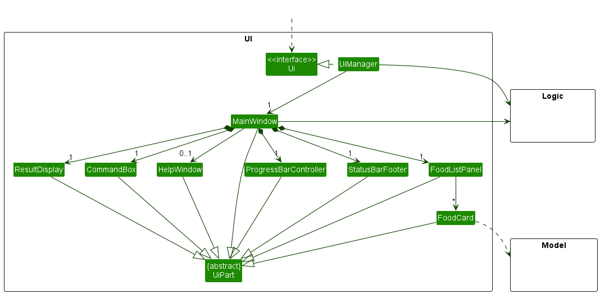
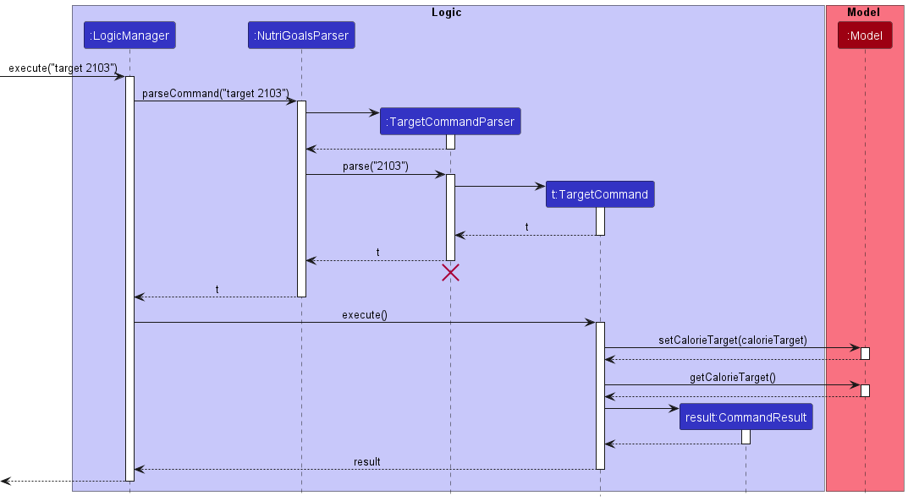
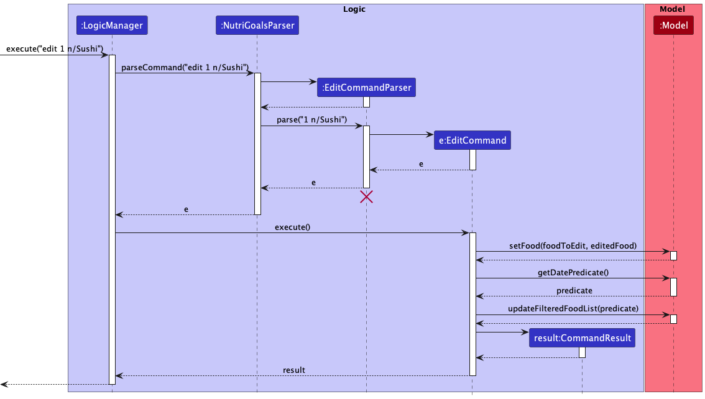
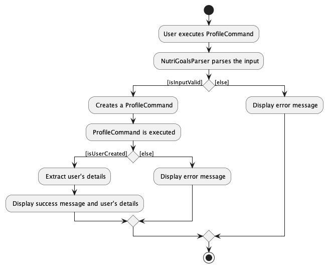
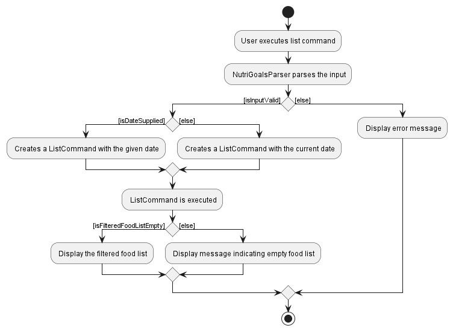
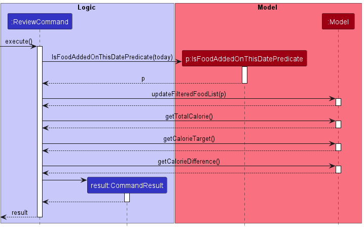
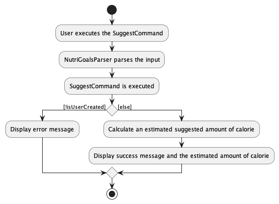
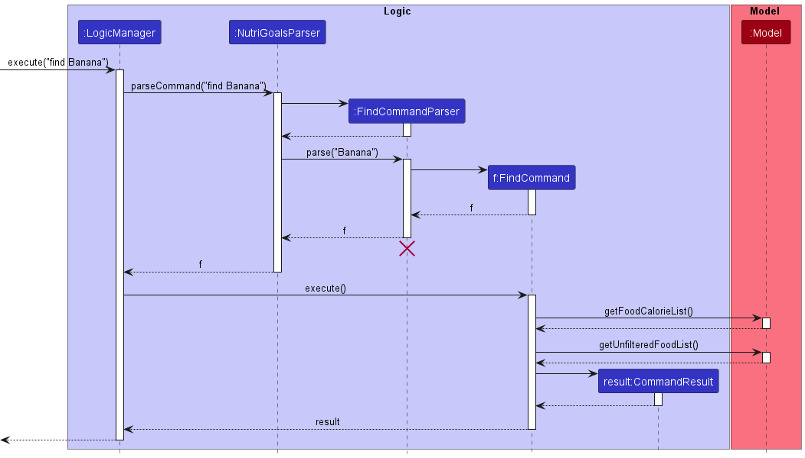
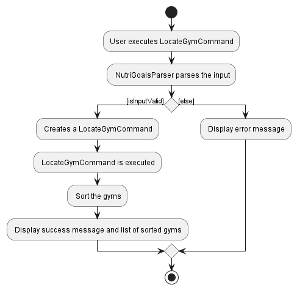

## Table of contents

* Table of Contents
{:toc}

--------------------------------------------------------------------------------------------------------------------

<div markdown="block" class="index">

## **Acknowledgements**

This project is based on the [AddressBook-Level3](https://github.com/se-edu/addressbook-level3) project created by the [SE-EDU initiative](https://se-education.org).

--------------------------------------------------------------------------------------------------------------------

## **Setting up, getting started**

Refer to the guide [_Setting up and getting started_](SettingUp.md).

--------------------------------------------------------------------------------------------------------------------

## **Design**

<div markdown="span" class="alert alert-primary">

:bulb: **Tip:** The `.puml` files used to create diagrams in this document can be found in
the [diagrams](https://github.com/AY2223S1-CS2103T-T17-2/tp/tree/master/docs/diagrams) folder. Refer to the [_PlantUML
Tutorial_ at se-edu/guides](https://se-education.org/guides/tutorials/plantUml.html) to learn how to create and edit
diagrams.
</div>

<div markdown="span" class="alert alert-info">:information_source: **Note:**<br>

For sequence diagrams, the lifeline of an object should end at the destroy marker (X). However, due to a limitation of 
PlantUML, the lifeline reaches the end of the diagram.

</div>

### Architecture


The ***Architecture Diagram*** given above explains the high-level design of the App.

Given below is a quick overview of main components and how they interact with each other.

**Main components of the architecture**

**`Main`** has two classes
called [`Main`](https://github.com/AY2223S1-CS2103T-T17-2/tp/blob/master/src/main/java/seedu/nutrigoals/Main.java)
and [`MainApp`](https://github.com/AY2223S1-CS2103T-T17-2/tp/blob/master/src/main/java/seedu/nutrigoals/MainApp.java). It
is responsible for,

* At app launch: Initializes the components in the correct sequence, and connects them up with each other.
* At shut down: Shuts down the components and invokes cleanup methods where necessary.

[**`Commons`**](#common-classes) represents a collection of classes used by multiple other components.

The rest of the App consists of four components.

* [**`UI`**](#ui-component): The UI of the App.
* [**`Logic`**](#logic-component): The command executor.
* [**`Model`**](#model-component): Holds the data of the App in memory.
* [**`Storage`**](#storage-component): Reads data from, and writes data to, the hard disk.

**How the architecture components interact with each other**

The *Sequence Diagram* below shows how the components interact with each other for the scenario where the user issues
the command `delete 1`.


Each of the four main components (also shown in the diagram above),

* defines its *API* in an `interface` with the same name as the Component.
* implements its functionality using a concrete `{Component Name}Manager` class (which follows the corresponding
  API `interface` mentioned in the previous point.

For example, the `Logic` component defines its API in the `Logic.java` interface and implements its functionality using
the `LogicManager.java` class which follows the `Logic` interface. Other components interact with a given component
through its interface rather than the concrete class (reason: to prevent outside component's being coupled to the
implementation of a component), as illustrated in the (partial) class diagram below.


The sections below give more details of each component.

### UI component

**API**: [`Ui.java`](https://github.com/AY2223S1-CS2103T-T17-2/tp/blob/master/src/main/java/seedu/nutrigoals/ui/Ui.java)



The UI consists of a `MainWindow` that is made up of parts e.g.`CommandBox`, `ResultDisplay`, `FoodListPanel`
, `StatusBarFooter` etc. All these, including the `MainWindow`, inherit from the abstract `UiPart` class which captures
the commonalities between classes that represent parts of the visible GUI.

The `UI` component uses the JavaFx UI framework. The layout of these UI parts are defined in matching `.fxml` files that
are in the `src/main/resources/view` folder. For example, the layout of
the [`MainWindow`](https://github.com/AY2223S1-CS2103T-T17-2/tp/blob/master/src/main/java/seedu/nutrigoals/ui/MainWindow.java)
is specified
in [`MainWindow.fxml`](https://github.com/AY2223S1-CS2103T-T17-2/tp/blob/master/src/main/resources/view/MainWindow.fxml)

The `UI` component,

* executes user commands using the `Logic` component.
* listens for changes to `Model` data so that the UI can be updated with the modified data.
* keeps a reference to the `Logic` component, because the `UI` relies on the `Logic` to execute commands.
* depends on some classes in the `Model` component, as it displays `Food` object residing in the `Model`.

### Logic component

**API** : [`Logic.java`](https://github.com/AY2223S1-CS2103T-T17-2/tp/blob/master/src/main/java/seedu/nutrigoals/logic/Logic.java)

Here's a (partial) class diagram of the `Logic` component:


How the `Logic` component works:

1. When `Logic` is called upon to execute a command, it uses the `NutriGoalsParser` class to parse the user command.
2. This results in a `Command` object (more precisely, an object of one of its subclasses e.g., `AddCommand`) which is
   executed by the `LogicManager`.
3. The command can communicate with the `Model` when it is executed (e.g. to add a food).
4. The result of the command execution is encapsulated as a `CommandResult` object which is returned back from `Logic`.

The Sequence Diagram below illustrates the interactions within the `Logic` component for the `execute("delete 1")` API
call.


Here are the other classes in `Logic` (omitted from the class diagram above) that are used for parsing a user command:


How the parsing works:

* When called upon to parse a user command, the `NutriGoalsParser` class creates an `XYZCommandParser` (`XYZ` is a
  placeholder for the specific command name e.g., `AddCommandParser`) which uses the other classes shown above to parse
  the user command and create a `XYZCommand` object (e.g., `AddCommand`) which the `NutriGoalsParser` returns back as
  a `Command` object.
* All `XYZCommandParser` classes (e.g., `AddCommandParser`, `DeleteCommandParser`, ...) inherit from the `Parser`
  interface so that they can be treated similarly where possible e.g, during testing.

### Model component

**API** : [`Model.java`](https://github.com/AY2223S1-CS2103T-T17-2/tp/blob/master/src/main/java/seedu/nutrigoals/model/Model.java)


The `Model` component,

* stores the nutrigoals data i.e., all `Food` objects (which are contained in a `FoodList` object).
* stores the currently 'selected' `Food` objects (e.g., results of a search query) as a separate _filtered_ list which is exposed to outsiders as an unmodifiable `ObservableList<Food>` that can be 'observed' e.g. the UI can be bound to this list so that the UI automatically updates when the data in the list change.
* stores a `UserPref` object that represents the user’s preferences. This is exposed to the outside as
  a `ReadOnlyUserPref` objects.
* does not depend on any of the other three components (as the `Model` represents data entities of the domain, they
  should make sense on their own without depending on other components)

### Storage component

**API** : [`Storage.java`](https://github.com/AY2223S1-CS2103T-T17-2/tp/blob/master/src/main/java/seedu/nutrigoals/storage/Storage.java)


The `Storage` component,

* can save both nutrigoals data and user preference data in json format, and read them back into corresponding objects.
* inherits from both `NutriGoalsStorage` and `UserPrefStorage`, which means it can be treated as either one (if only the functionality of only one is needed).
* depends on some classes in the `Model` component (because the `Storage` component's job is to save/retrieve objects
  that belong to the `Model`)

### Common classes

Classes used by multiple components are in the `seedu.nutrigoals.commons` package.

--------------------------------------------------------------------------------------------------------------------

## **Implementation**
This section describes some noteworthy details on how certain features are implemented.

### Set Daily Calorie Target feature

#### Implementation

The set target mechanism is facilitated by `TargetCommand`, which extends `Command`. It overrides the following
operation:

* `TargetCommand#excecute()`: Sets the calorie target for the day

Given below is an example usage scenario and how set calorie target mechanism behaves at each step.

Step 1. The user launches the application today.

Step 2. The user executes `target 2103`, which calls `LogicManager#execute()`. 
`NutriGoals#parseCommand()` is called subsequently, which then creates a `TargetCommandParser` object.
`TargetCommandParser#parser()` is then called to make sense of the arguments supplied by the user.

Step 3. The `TargetCommand` is created, and then executed by `TargetCommand#execute()`.

Step 4. The `TargetCommand#execute()` calls the following methods from `Model`:
* `setCalorieTarget(calorieTarget)`
* `getCalorieTarget()`

Step 5. `TargetCommand#execute()` returns a `CommandResult` with the following result displayed:

Your calorie target set for today: 2103 calories

The following diagram illustrates how the set calorie target operation works:



### Edit feature

#### Implementation

The edit mechanism is facilitated by `EditCommand`, which extends `Command`. It overrides the following operation:

* `EditCommand#execute()`: Edits the food name, meal type or calories associated with the food at the specified index.

Given below is an example usage scenario and how the edit mechanism behaves at each step.

Step 1. The user launches the application on 19 October 2022. Suppose the foods added for the day are:

1. bread: 100 calories, breakfast
2. milk tea: 300 calories, lunch
3. sushi: 500 calories, lunch

Step 2. The user executes `edit 2 n/honey milk tea c/310`, which calls `LogicManager#execute()`.
`NutriGoals#parseCommand()` is called subsequently, which then creates an `EditCommandParser` object.
`EditCommandParser#parse()` is then called to make sense of the arguments supplied by the user.

Step 3. The `EditCommand` is created, and then executed by `EditCommand#execute()`.

Step 4. `EditCommand#execute()` calls the following methods from `Model`:

* `Model#setFood(foodToEdit, editedFood)` replaces `foodToEdit` to `editedFood`.
* `Model#updateFilteredFoodList(predicate)` filters the food list based on the given predicate

Step 5. `EditCommand#execute()` returns a `CommandResult` with the following result displayed:

```
Food item edited!

Food name: honey milk tea
Calorie content: 310 calories
Meal type: lunch
```

The following diagram illustrates how the edit operation works:



### Setup feature

#### Implementation

The setup mechanism is facilitated by `SetupCommand`, which extends `Command`. It overrides the following 
operation: 

* `SetupCommand#execute()`: Sets up the user profile.

Given below is an example usage scenario of how the setup mechanism behaves at each step.

Step 1. The user launches the application.

Step 2. The user executes `setup h/170 w/65 i/60 g/m a/20`, which calls `LogicManager#execute()`. `NutriGoals#parseCommand()` 
is called subsequently, which then creates an `SetupCommand` object.

Step 3. The `SetupCommand` created is executed by `SetupCommand#execute()`.

Step 4. `SetupCommand#execute()` calls the following methods from `Model`:

* `Model#setUserDetails()`
* `Model#getUserDetails()`

Step 5. `SetupCommand#execute()` returns a `CommandResult` which displays the user's information.

The following diagram illustrates how the setup operation works.


### Profile feature

#### Implementation

The profile mechanism is facilitated by `ProfileCommand`, which extends `Command`. It overrides the
following operation:

* `ProfileCommand#execute()`: Retrieves and displays the user's information.

Given below is an example usage scenario and how the profile mechanism behaves at each step.

Step 1. The user launches the application on 19 October 2022.

Step 2. The user executes `profile`, which calls `LogicManager#execute()`. `NutriGoals#parseCommand()` is called
subsequently, which then creates an `ProfileCommand` object.

Step 3. The `ProfileCommand` created is executed by `ProfileCommand#execute()`.

Step 4. `ProfileCommand#execute()` calls the following methods from `Model`:

* `Model#isUserCreated()`
* `Model#getUserDetails()`

Step 5. `ProfileCommand#execute()` returns a `CommandResult` which displays the user's information.

The following activity diagram outlines the process when the user executes the `ProfileCommand`.



### List feature

#### Implementation

The list mechanism is facilitated by `ListCommand`, which extends `Command`. It overrides the following operation:

* `ListCommand#execute()`: Shows a list of all food items and their respective calories for the specified day (if any).

Given below is an example usage scenario and how the list mechanism behaves at each step.

Step 1. The user launches the application on 19 October 2022. `NutriGoals` initially displays all foods added on the 
current day, 19 October 2022.

Step 2. The user executes `list 2022-07-29` command, which calls `LogicManager#execute()`.
`NutriGoals#parseCommand()` is called subsequently, which then creates a `ListCommandParser` object.
`ListCommandParser#parse()` is then called to make sense of the date argument supplied by the user.

Step 3. A `ListCommand` object is created with an `IsFoodAddedOnThisDatePredicate` object. The predicate is initialised with 29 July 2022 as the date.

The following object diagram illustrates this.


Step 4. `ListCommand` is then executed by `ListCommand#execute()`, which calls the following methods from `Model`:

* `Model#updateFilteredFoodList(IsFoodAddedOnThisDatePredicate)` filters the food list for foods added on 29 July 2022
* `Model#isFilteredFoodListEmpty()`

Step 5. The filtered food list is shown to the user and `ListCommand#execute()` returns a `CommandResult` with a message 
indicating the successful execution of the `list` command. 

The following activity diagram summarizes what happens when a user executes the `list` command:



### Review feature

#### Implementation

The review mechanism is facilitated by `ReviewCommand`, which extends `Command`. It overrides the following operation:

* `ReviewCommand#execute()`: Calculates the total calories, the calorie target and the deficient or excess amount of
  calories for the day.

Given below is an example usage scenario and how the review mechanism behaves at each step.

Step 1. The user launches the application on 19 October 2022. Suppose the foods added for the day are:

1. bubble tea: 232 kcal
2. chicken rice: 702 kcal
3. wanton noodles: 409 kcal

Step 2. The user executes `review` command, which creates a `ReviewCommand` object. 

Step 3. The `ReviewCommand` created is executed by `ReviewCommand#execute()`. 

Step 4. `ReviewCommand#execute()` creates an `IsFoodAddedOnThisDatePredicate` object with 19 October 2022 as the date.

Step 5. `ReviewCommand#execute()` then calls the following methods from `Model`:

* `Model#updateFilteredFoodList(IsFoodAddedOnThisDatePredicate)` filters the food list for foods added on 19 October 2022
* `Model#getTotalCalorie()`
* `Model#getCalorieTarget()`
* `Model#getCalorieDifference()`

Step 6. `ReviewCommand#execute()` returns a `CommandResult` with the following information to be displayed to the user:

* total calories: 1343 kcal
* calorie target: 2000 kcal
* deficient amount of calories: 657 kcal

The following sequence diagram illustrates how the review operation works:



### Suggest feature

#### Implementation

The suggest mechanism is facilitated by `SuggestCommand`, which extends `Command`. It overrides the following operation:

* `SuggestCommand#execute()`: Calculates a suggested amount of calories a user should consume per day.

The following illustrates what objects are created when `suggest` is executed.


Given below is an example usage scenario and how the suggest mechanism behaves at each step.

Step 1. The user launches the application today.

Step 2. The user executes `suggest` command, which creates a `SuggestCommand` object.

Step 3. The `SuggestCommand` created is executed by `SuggestCommand#execute()`.

Step 4. `SuggestCommand#execute()` then calls the following methods from `Model`:

* `Model#isUserCreated()`
* `Model#calculateSuggestedCalorie()`

Step 5. `SuggestCommand#execute()` returns a `CommandResult` that displays an estimated suggested amount of calories the user should consume per day.

The following activity diagram outlines what happens when a user executes the `suggest` command:



### Find feature

#### Implementation

The find mechanism is facilitated by `FindCommand`, which extends `Command`. It overrides the following operations

* `FindCommand#execute()`: Looks through all previously consumed food items and searches for those whose name matches the predicate. Returns the average calorie content for that particular food item if it is inside the list. If it is not in the list, checks if the food item is in the default list provided, and returns the suggested calorie content from the default list.

Given below is an example usage scenario and how the find mechanism behaves at each step.

Step 1. The user launches the application.

Step 2. The user executes `find Banana` command, which calls `LogicManager#execute()`.
`NutriGoals#parseCommand()` is called subsequently, which then creates a `FindCommandParser` object.
`FindCommandParser#parse()` is then called to make sense of the food name supplied by the user.

Step 3. A `FindCommand` object is created and then executed by `FindCommand#execute()`.

Step 4. The `FindCommand#execute()` then calls the following methods from `Model`

* `Model#getFoodCalorieList()`
* `Model#getUnfilteredFoodList()`

Step 5. The `FindCommand#execute()` returns a `CommandResult` that displays the calorie content of the food item specified by the user which in this case is Banana.



### Locate gym feature

#### Implementation

The locate gym mechanism is facilitated by `LocateGymCommand`, which extends `Command`. It overrides the
following operation:

* `LocateGymCommand#execute()`: Returns a list of gyms sorted by distance.

Given below is an example usage scenario and how the locate-gym mechanism behaves at each step.

Step 1. The user launches the application.

Step 2. The user executes `locate CLB`, which calls `LogicManager#execute()`. `NutriGoals#parseCommand()` is called
subsequently, which then creates an `LocateGymCommand` object.

Step 3. The `LocateGymCommand` created is executed by `LocateGymCommand#execute()`.

Step 4. `LocateGymCommand#execute()` calls the following methods from `Model`:

* `Model#getNusGymLocations()`

The following activity diagram outlines what happens when a user executes the `locate` command:



--------------------------------------------------------------------------------------------------------------------

## **Documentation, logging, testing, configuration, dev-ops**

* [Documentation guide](Documentation.md)
* [Testing guide](Testing.md)
* [Logging guide](Logging.md)
* [Configuration guide](Configuration.md)
* [DevOps guide](DevOps.md)

--------------------------------------------------------------------------------------------------------------------

## **Appendix: Requirements**

### Product scope

**Target user profile**:

* NUS students
* Wishes to get healthier or fitter
* Wishes to track their daily calorie intake
* Wants to know how many calories they should consume daily
* Wants to know how many calories are in their food
* Is reasonably comfortable using CLI apps

**Value proposition**: Help users manage and calculate their calorie intake quickly, get recommendations on their daily calorie intake, learn about the calorie content of food items and find the nearest gyms in NUS in order to meet their health and fitness goals

### User stories

Priorities: High (must have) - `* * *`, Medium (nice to have) - `* *`, Low (unlikely to have) - `*`

| Priority | As a            | I want to                                                         | So that I can…                                                        |
|----------|-----------------|-------------------------------------------------------------------|-----------------------------------------------------------------------|
| `* * *`  | careless user   | delete a wrongly added meal                                       | fix my food records easily                                            |
| `* * *`  | user            | add my daily calorie intake                                       | know how much I am eating                                             |
| `* * *`  | food enthusiast | calculate my daily calorie intake                                 | know how nutrient dense my food is                                    |
| `* * *`  | careless user   | edit a meal wrongly recorded                                      | change my food records easily                                         |
| `* * *`  | forgetful user  | find my list of foods consumed for any day                        | get a better understanding of my eating habits                        |
| `* *`    | user            | key in the calorie intake for each type of food                   | remember how many calories a particular food I have consumed contains |
| `* *`    | user            | specify my body composition                                       | find out how many calories I should be consuming based on my profile  |
| `* *`    | user            | calculate my BMI                                                  | know if my current weight is in a healthy range                       |
| `* *`    | sedentary user  | get information on healthy lifestyle habits                       | adopt a more active lifestyle                                         |
| `* *`    | nus student     | find the nearest gym in school based on where I am at             | know where to go if I want to exercise                                |
| `* *`    | user            | get a suggested daily calorie intake based on my body composition | know what would be a reasonable calorie target                        |
| `* *`    | user            | find the calorie content of a food item                           | know how many calories I am consuming for a particular food           |
| `*`      | forgetful user  | receive information about my calorie deficiency / excess          | know if I should consume more / less calories                         |

*{More to be added}*

### Use cases

For all use cases below, the **System** is the `NutriGoals` application and the **Actor** is the `user`, unless specified otherwise.

**Use case: UC-1 List food items**

**MSS**

1. User requests to list the food items consumed on a particular date.
2. NutriGoals shows the list of food items consumed on the specified date.

   Use case ends.

**Extension**

* 1a. No food item recorded on the specified date.

    * 1a1. NutriGoals displays a default message.

      Use case ends.

* 1b. The date provided is invalid.

    * 1b1. NutriGoals shows an error message.
  
      Use case ends.

**Use case: UC-2 Add a meal**

**MSS**

1. User enters the command to add a food item.
2. NutriGoals shows the new list of food items.

   Use case ends.

**Extension**

* 1a. The information provided is invalid.

    * 1a1. NutriGoals shows an error message.

      Use case ends.

**Use case: UC-3 Delete a meal**

**MSS**

1. User requests to <ins>list the meals recorded (UC-1)</ins>.
2. NutriGoals shows a list of meals.
3. User requests to delete a specific meal in the list.
4. NutriGoals deletes the meal.

   Use case ends.

**Extensions**

* 2a. The list is empty.

  Use case ends.

* 3a. The specified food item is invalid.

    * 3a1. NutriGoals shows an error message.

      Use case resumes at step 2.

**Use case: UC-4 Edit a meal**

**MSS**

1. User requests to <ins>list all the meals recorded (UC-1)</ins>.
2. NutriGoals shows a list of meals.
3. User requests to edit a specific meal in the list.
4. NutriGoals edits the meal.

   Use case ends.

**Extensions**

* 2a. The list is empty.

  Use case ends.

* 3a. The edited food item is invalid.

    * 3a1. NutriGoals shows an error message.

      Use case resumes at step 2.

**Use case: UC-5 Set up a profile**

**MSS**

1. User requests to set up his / her profile.
2. NutriGoals creates and saves the user's profile.

   Use case ends.

**Extensions**

* 1a. The information provided is invalid.

    * 1a1. NutriGoals shows an error message.

      Use case resumes at step 1.

**Use case: UC-6 View the profile created**

**MSS**

1. User requests to view his / her profile.
2. NutriGoals shows the user's profile.

   Use case ends.

**Extensions**

* 1a. User profile is not created.

    * 1a1. NutriGoals requests the user to set up a profile.

    * 1a2. User requests to <ins>set up his / her profile (UC-5)</ins>.

      Use case resumes at step 1.

**Use case: UC-7 View a summary of the daily calorie intake**

**MSS**

1. User requests to view a summary of the daily calorie intake.
2. NutriGoals shows the user's total calories consumed, the calorie target and the deficient or excess amount of
   calories for the day.

   Use case ends.

**Use case: UC-8 Find the calorie content of a food item**

**MSS**

1. User requests to find the calorie content of a food item.
2. NutriGoals shows the calorie content of the specified food item.

   Use case ends.

**Extensions**

* 1a. The specified food item is invalid.

    * 1a1. NutriGoals shows an error message.

      Use case ends.

* 1b. There is no calorie content information for the specified food item.

    * 1b1. NutriGoals displays a default message.

      Use case ends.

**Use case: UC-9 Get a suggested amount of calorie to consume daily**

**MSS**

1. User requests to get an estimated suggested amount of calorie to consume daily.
2. NutriGoals shows the suggested amount of calorie to consume.

   Use case ends.

**Extensions**

* 1a. User profile is not created.

  * 1a1. NutriGoals requests user to <ins>create a profile first (UC-5).
    
    Use case resumes at step 1.

### Non-Functional Requirements

1. Should work on any _mainstream OS_ as long as it has Java `11` or above installed.
2. Should be able to hold up to 1000 foods without a noticeable sluggishness in performance for typical usage.
3. A user with above average typing speed for regular English text (i.e. not code, not system admin commands) should be
   able to accomplish most of the tasks faster using commands than using the mouse.
4. The system should respond to a command within two seconds.
5. Project scope:
    * The system only handles information regarding the calorie intake of a food and no other nutrients.

*{More to be added}*

### Glossary

* **Calorie(s)**: Unit of measurement for amount of food consumed.

* **Daily Recommended Calorie Intake**: The amount of calories recommended by experts for an individual to consume daily
  (According to Health Promotion Board Singapore, adult males should consume 2200 calories, adult females
  should consume 1800 calories).

* **Deficit**: The amount of calories <ins>not</ins> consumed in order to facilitate fat burning and weight loss.

* **Macros**: Proteins, Carbohydrates, Fats e.t.c., macronutrient groups that provide people with energy.

* **Meals**: Breakfast, Lunch, Dinner e.t.c., categories for users to input their daily meals under.

* **Surplus**: The amount of calories consumed in excess of the recommended daily intake to facilitate mass gain.

--------------------------------------------------------------------------------------------------------------------

## **Appendix: Instructions for manual testing**

Given below are instructions to test the app manually.

<div markdown="span" class="alert alert-info">:information_source: **Note:** These instructions only provide a starting point for testers to work on;
testers are expected to do more *exploratory* testing.

</div>

### Launch and shutdown

1. Initial launch

    1. Download the jar file and copy into an empty folder.

    2. Double-click the jar file Expected: Shows the GUI with a set of sample food items. The window size may not be
       optimum.

2. Saving window preferences

    1. Resize the window to an optimum size. Move the window to a different location. Close the window.

    2. Re-launch the app by double-clicking the jar file.<br>
       Expected: The most recent window size and location is retained.

### Adding a food

1. Adding a food item into the list

    1. Test case: `add n/Sushi c/400 t/lunch`<br />
       Expected: Sushi is added into the food list, and it is tagged as a lunch item with 400 calories.

    2. Test case: `add n/Sushi c/400`<br />
       Expected: Sushi is not added into the food list as there are missing fields. Error details are shown on the result display.

    3. Test case: `add n/Sushi t/lunch`<br />
       Expected: Similar to #2.

    4. Test case: `add n/Sush! t/breakfast c/300`<br />
       Expected: Sush! is not added into the food list as the food name (Sush!) is invalid. Error details are shown on the result display.

    5. Other invalid add commands to try: `add n/Sushi c/300.5 t/lunch`, `add n/Sushi c/300 t/supper`, `...` (where any field specified does not conform to the expected format).

### Deleting a food

1. Deleting a food while all foods on a particular day are being shown

    1. Prerequisites: List all foods on a particular day using the `list` command. Multiple foods in the list.

    2. Test case: `delete 1`<br>
       Expected: First food item is deleted from the list. Details of the deleted food shown in the status message.
       Timestamp in the status bar is updated.

    3. Test case: `delete 0`<br>
       Expected: No food is deleted. Error details shown in the status message. Status bar remains the same.

    4. Other incorrect delete commands to try: `delete`, `delete x`, `...` (where x is larger than the list size)<br>
       Expected: Similar to previous.

### Editing a food

1. Editing a food while all foods on a particular day are being shown

    1. Prerequisites: List all foods on a particular day using the `list` command. Multiple foods in the list.

    2. Test case: `edit 1 n/Pancake c/250`<br />
       Expected: The name and calorie of the first food item is changed to Pancake and 250 respectively.

    3. Test case: `edit 0 n/Pancake c/250`<br />
       Expected: No food is edited. Error details are shown on the result display.

    4. Test case: `edit 1 n/P@ncake`<br />
       Expected: No food is edited. Error details are shown on the result display.

    5. Test case: `edit 4`<br />
       Expected: No food is edited. Error details are shown on the result display.

    6. Other invalid edit command formats to try: `edit 1 n/Pancake t/snack`, `edit 1 c/150.2`, `...` (where any field specified does not conform to the expected format).<br />
       Expected: Similar to previous.

### Setting a target calorie

1. Setting a target calorie to consume

    1. Test case: `target 2500`<br />
       Expected: The target calorie is set to 2500 calories. Success message is displayed on the result display.

    2. Test case: `target 2500.5`<br />
       Expected: Target calorie is not set. Error details are shown on the result display.

    3. Other invalid target command formats to try: `target x` (where x is not an integer value).

### Setting up a user profile

1. Setting up a user profile

    1. Test case: `setup g/m a/20 w/70 i/70 h/175`<br />
       Expected: The user profile is created successfully.

    2. Test case: `setup g/m a/20 w/70.5 i/70 h/175`<br />
       Expected: The user profile is not created. Error details are shown on the result display.

    3. Other invalid setup command formats to try: `setup g/s a/20 w/70 i/70 h/175`, `setup g/f a/20 w/70 i/70 h/175.5`, `...` (where each field specified does not conform to the expected format.)

### Saving data

1. Dealing with corrupted data files

   1. To simulate a corrupted file,
   
      1. Launch and close the application.
      
      2. Ensure the `./data/nutrigoals.json` is created.
      
      3. Corrupt the file by adding a '@' character in any of the food's name.
      
   2. Relaunch the application.<br />
      Expected behaviour: The GUI is launched without any data.
   
   3. Delete the `nutrigoals.json`.
   
   4. Relaunch the application.<br />
      Expected behaviour: The GUI is launched with the sample data.

2. Dealing with missing data files

    1. To simulate a missing file
        
        1. Ensure that `./data/nutrigoals.json` exists.

        2. Delete `./data/nutrigoals.json`.
    
    2. Relaunch the GUI. <br />
       Expected behaviour: The GUI is launched with the sample data.

</div>
