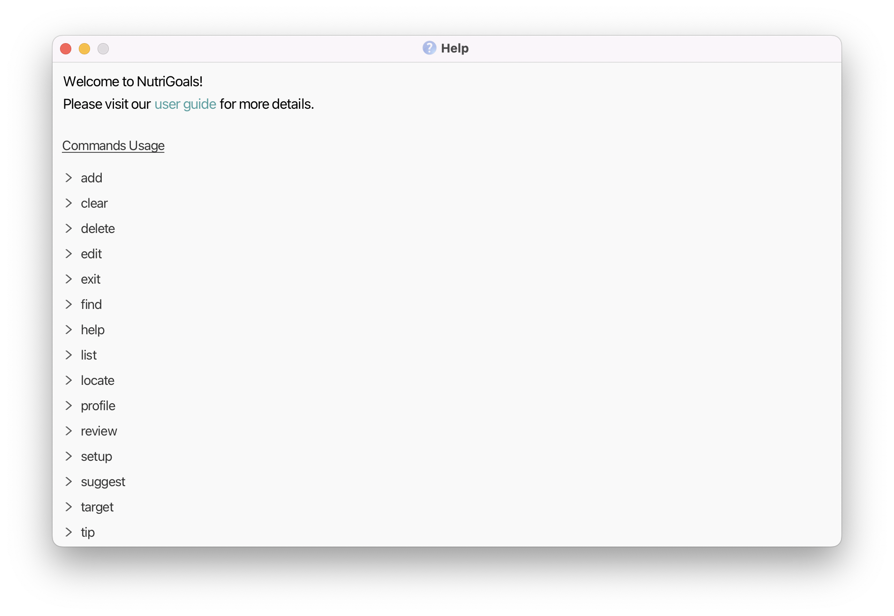

NutriGoals is a desktop app that tracks a user’s diet and calorie consumption. Studies have shown the benefits of keeping track of your daily food consumption – the more consistent you are, the more likely you are to achieve the various fitness goals that you have set for yourself! However, without the right tools, tracking what you have consumed can be tedious and at times disorganised. With NutriGoals, you can keep track of your consumption quickly and easily, without worrying about organising your data.
* Table of Contents
{:toc}

--------------------------------------------------------------------------------------------------------------------

## Quick start

1. Ensure you have Java `11` or above installed in your Computer.

2. Download NutriGoals.jar.

3. Double-click the file to start the app.

4. Refer to the [Features](#features) below for details of each command.

--------------------------------------------------------------------------------------------------------------------

## Features

**:information_source: Notes about the command format:** 

* Texts in UPPER_CASE are arguments provided by the user.

### Viewing help : `help`

Shows a message explaning how to access the help page.

Format: `help`

### Adding the calorie content of a food item : `add`

Adds a food item with its calorie content.
Format: `add FOOD_ITEM CALORIES MEAL_TYPE`

### Deleting a food item : `delete`

Removes a food item from the list of consumed food for the day.

Format: `delete FOOD_ITEM MEAL_TYPE`

### Editing a food item : `edit`

Edits a food item from the list of consumed food for the day.

Format: `edit MEAL_TYPE INDEX UPDATED_FOOD_ITEM CALORIES`

### Show the daily calorie intake: `review`

Show the total calories consumed and the food consumed for the day.

Format: `review`

### Listing all food items consumed : `list`

Shows a list of all food items recorded for that day.

Format: `list`

### Exiting the program : `exit`

Exits the program.

Format: `exit`

_Details coming soon ..._

--------------------------------------------------------------------------------------------------------------------

## FAQ

**Q**: How do I transfer my data to another Computer? 
**A**: Install the app in the other computer and overwrite the empty data file it creates with the file that contains the data of your previous AddressBook home folder.

--------------------------------------------------------------------------------------------------------------------

## Command summary

 Action     | Format                             | Examples
------------|----------------------------------- | --------------------------------------------------------------------  
 **Add**    | `add FOOD_ITEM CALORIES MEAL_TYPE` | ` add donut 1000 breakfast`
 **Delete** | `delete MEAL_TYPE FOOD_ITEM`       |  `delete lunch cake`                                                                         
 **Edit**   | `edit MEAL_TYPE INDEX UPDATED_FOOD_ITEM CALORIES`         | `edit dinner 2 rice 300 ` 
 **review** | `review`                           | `review`                                                                 
 **List**   | `list`                             |    `list`                                                                                                     
 **exit**   | `exit`                             |    `exit`                                                                                                     

